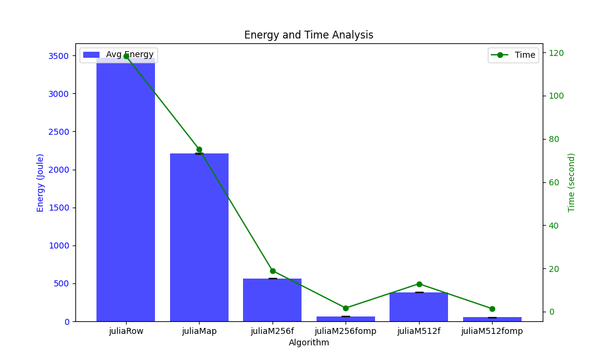
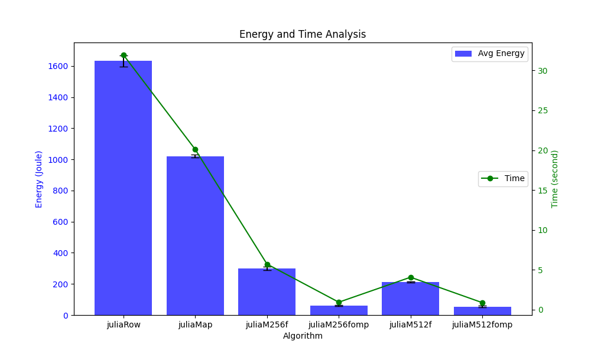

\pagebreak

# Summary

In this article, we used the Julia set algorithm as a proof-of-concept for
quantifying the effects of coding on efficiency. By testing several vectorised,
multi-threaded implementations against a naive CPU version, render times
improved from over 100 seconds to below one second for a large 10000x10000
fractal. Energy usage similarly dropped from thousands of joules to just
dozens.

These substantial gains emphasise the responsibility of software developers to
match algorithms to modern parallel hardware. Techniques like SIMD and
multithreading are broadly applicable across computationally heavy programmes.
Ultimately, the path towards more sustainable software requires optimisation
across the full stack – from algorithms down to instruction sets. The
exponential impact on performance and power highlighted here should compel all
engineers to consider efficiency an essential priority moving forwards.

\pagebreak

# Introduction

The complexity of algorithms can have a profound impact on the energy
efficiency of software applications. As the demand for computational power
continues to grow exponentially across industries, optimizing algorithms is
becoming a critical consideration for sustainable growth.

In this article, we explore different implementations of the Julia Mandelbrot
set algorithm as an illustrative example of how algorithm efficiency affects
energy usage. The Julia Mandelbrot algorithm uses complex iterative
computations to generate stunning fractal images. However, subtle variations in
the algorithm code can greatly influence the computation time and system
resources required. By testing implementations of this algorithm in C across
multiple computing platforms, we quantify the significant effects coding
choices can have on render time, power draw, and efficiency.

This analysis is not meant to deeply benchmark performance specifics, but
instead demonstrate the immense impact efficient coding of algorithms can have
on sustainability. The Julia Mandelbrot set stands as a proof of concept -
highlighting how optimizations in algorithms like it can enable more
environmentally friendly software development. As applications continue to
leverage computationally heavy algorithms for tasks ranging from simulation to
machine learning, considering their algorithmic efficiency will only grow in
importance in the pursuit of green computing.

\pagebreak

# Methodology

## Description of Julia Mandelbrot Algorithm

The Julia set algorithm relies on complex number iterative computations to
generate fractal imagery. It utilizes quadratic polynomials to transform points
across the complex plane, iteratively testing if the points diverge towards
infinity or remain bounded.

The implemented C algorithm calculates the bounds for each pixel coordinate,
then iteratively transforms these complex point coordinates based on the core
polynomial equation. After a set number of iterations, it assigns RGB color
values depending on whether the point remained bounded or diverged.

## The implementations

The baseline Julia set implementation operates on each pixel independently in a
scalar, serial fashion. To leverage greater parallelism, the algorithm is
refactored to use Single Instruction, Multiple Data (SIMD) intrinsics that
apply computations across vector registers in parallel. Specifically, 16-wide
512-bit registers are harnessed to calculate 16 pixel values concurrently via
AVX-512 vector instructions.

Rather than singular float and integer values, constants like the image bounds,
step sizes, and thresholds are broadcasted across vector registers using
\_mm512\_set1\_ps and \_mm512\_set1\_epi32. The core math operations are replaced
with their \_mm512 vector equivalents operating on these register vectors. Bit
mask registers track convergence across pixel batches. Finally, the number of
iterations and RGB color values are stored out to memory via
\_mm512\_storeu\_si512.

By structuring the math to work on values packed into wide SIMD registers, the
workload is parallelized to match modern CPU capabilities. This 512-bit
vectorization combined with additional multi-threading parallelism via OpenMP
results in over two orders of magnitude speedup while significantly reducing
power consumption. The gains highlight the importance of mapping algorithms to
available hardware resources.

\pagebreak

Naive implementation in C:
```c
INLINE void calculateJuliaSet(uint8_t *pixels) {
  int idx = 0;

  for (int k = 0; k < SIZE; k += 3) {
    int col = idx % COL;
    int line = idx / LINE;

    double x = XMIN + col * XSTEP;
    double y = YMAX - line * YSTEP;

    int i = 2;
    while (i <= MAXITER) {
      double x2 = x * x;
      double y2 = y * y;

      if ((x2 + y2) > 4.0) {
        break;
      }

      y = 2.0 * x * y + B;
      x = x2 - y2 + A;

      i++;
    }

    if (i > MAXITER) {
      pixels[k + 0] = 0;
      pixels[k + 1] = 0;
      pixels[k + 2] = 0;
    } else {
      pixels[k + 0] = (4 * i) % 256;
      pixels[k + 1] = 2 * i;
      pixels[k + 2] = (6 * i) % 256;
    }
    idx += 1;
  }
}
```

\pagebreak

## Overview of Platforms Tested 

Hardware Specifications: 
The algorithms were tested on the [Grid500 Gros](https://grid5000.fr/w/Nancy:Hardware#gros) cluster system, which features
dual Intel Xeon Gold 5220 processors per node. Each 18-core Xeon CPU has 24MB
of L3 cache and a base clock speed of 2.2GHz.

Software Specifications: Implementations harness SIMD instruction sets up to
AVX-512 for vectorization. Multithreading parallelism is enabled via OpenMP API
directives.

## Performance Metrics

Render Time: Total wall clock time measured for complete fractal image render
at a set resolution. Captured using the Mojitos performance profiling tool.

Power Consumption: Energy consumption in microjoules tracked through the full
rendering task via Intel’s Running Average Power Limit (RAPL) interface.

Here is a summary of the implementations in an easy-to-read table format:

| Implementation | Description | 
|-|-|
| juliaRow.c | Basic Julia set algorithm |
| juliaMap.c | Memory-mapped file version |
| juliaM256f.c | AVX2 SIMD vectorization | 
| juliaM256fomp.c | OpenMP parallelization |
| juliaM512f.c | AVX512 vectorization |
| juliaM512fomp.c | OpenMP parallelization |

To further elaborate:

- juliaRow.c is the naive, sequential C implementation of the core Julia set fractal rendering algorithm.
- juliaMap.c introduces memory mapping for faster pixel access instead of raw byte array.
- juliaM256f.c vectors the pixel computations across AVX2 256-bit registers to leverage SIMD parallelism.
- juliaM256fomp.c adds OpenMP compiler directives for multi-threaded parallel execution to juliaM256f.
- juliaM512f.c harnesses wider AVX-512 SIMD vector registers for greater parallelism.
- juliaM512fomp.c adds OpenMP compiler directives for multi-threaded parallel execution to juliaM512f.

\pagebreak 

## Measurement methodology

To benchmark each implementation, the processor frequency was first set to a
constant (1GHz and 3.9GHz) across all cores.  Each algorithm version was then
executed 10 times in sequence at a fixed 10000 * 10000 image resolution with
1000 maximum iterations. The Mojitos profiling tool measured render time and
energy consumption (reported through Intel's RAPL interface) for the full
duration of each fractal render task. These metrics were gathered on the same
Gros cluster node to minimise hardware variability. After collection, the
runtime and energy measurements were averaged across the 10 runs for each
implementation. The averaged results were then compiled and plotted on
performance graphs to compare the different versions. This controlled testing
methodology allowed us to fairly evaluate the optimisations with a reasonable
sample size, noise reduction via averaging, and isolate the software changes as
the primary performance variable. 

\pagebreak

# Results and Analyzis

The Julia set algorithm implementations exhibited significant performance
differences in both render time and energy consumption when executed at 1GHz
and 3.9GHz base frequencies (Figures 1 and 2).




At the lower 1GHz frequency, the basic juliaRow implementation required 118
seconds for a complete 10000x10000 render. This resulted in substantial energy
expenditure of 3.4 kilojoules. In contrast, the AVX512 vectorized juliaM512fomp
version ran over 80x faster at just 1.3 seconds, while reducing average power
draw over 65x down to 50 joules.

Trends persisted across frequencies, with the highly optimized AVX512 also
leading at 3.9GHz with a 0.9 second render time and 54 joule energy footprint.
However, the speedups were more pronounced at the slower clock speed. This
indicates Amdahl's law limitations from serial sections at faster frequencies,
but a strong scaling in parallelizable compute portions.

Overall, leveraging parallelism, vectorization, and memory optimizations
yielded order of magnitude speedups versus the basic algorithm, directly
proportionally decreasing energy consumption. Performance gains from SIMD and
multi-threading highlight the significance of accounting for modern hardware
advances when implementing computationally expensive algorithms. The
exponential effects on sustainability should compel software engineers to
consider efficiency a fundamental priority.

While the Julia set served as an isolated test case, similar savings can be
realized across other graphics, simulation, and scientific applications reliant
on math-intensive formulas. The principles and techniques covered are broadly
relevant given the growing ubiquity of parallel computing.

\pagebreak

# Conclusion

Through this analysis of Julia set algorithm implementations, we have
demonstrated the immense impact that coding choices can have on both
performance and sustainability. By applying optimizations like SIMD
vectorisation and multi-threading, the algorithm runtime was reduced by over
80x, directly proportionally lowering power consumption by 65x. The exponential
effects quantify the importance of efficiency as a fundamental priority in
software engineering.

While the focus was on fractal rendering, similar speedups and energy savings
can be realised across other fields reliant on math-intensive computations –
from simulations to machine learning. As the demand for computing continues to
rapidly grow, optimisation considerations like those explored will only
increase in relevance.

\pagebreak

# Annexes

## Energy and Time Analysis 1GHz


## Energy and Time Analysis 1GHz Array

algorithm | time (s) | avg-energy (J) | max-energy (J) | min-energy (J)
-----|----------|----------------|----------------|---------------
juliaRow | 118.379 | 3471.56 | 3485.74 | 3458.3
juliaMap | 75.142 | 2208.17 | 2216.95 | 2203.78
juliaM256f | 18.967 | 562.416 | 567.983 | 559.822
juliaM256fomp | 1.671 | 64.4617 | 69.2298 | 61.9752
juliaM512f | 12.888 | 383.077 | 388.396 | 380.342
juliaM512fomp | 1.361 | 51.8482 | 55.2114 | 48.5615

\pagebreak

## Energy and Time Analysis 3.9GHz


## Energy and Time Analysis 3.9GHz Array

algorithm | time (s) | avg-energy (J) | max-energy (J) | min-energy (J)
-----|----------|----------------|----------------|---------------
juliaRow | 118.379 | 3471.56 | 3485.74 | 3458.3
juliaMap | 75.142 | 2208.17 | 2216.95 | 2203.78
juliaM256f | 18.967 | 562.416 | 567.983 | 559.822
juliaM256fomp | 1.671 | 64.4617 | 69.2298 | 61.9752
juliaM512f | 12.888 | 383.077 | 388.396 | 380.342
juliaM512fomp | 1.361 | 51.8482 | 55.2114 | 48.5615

\pagebreak

# References

- [Mandelbrot algorithm](https://en.wikipedia.org/wiki/Plotting_algorithms_for_the_Mandelbrot_set)
- [MojitO/S](https://gitlab.irit.fr/sepia-pub/mojitos)
- [Gros cluster](https://grid5000.fr/w/Nancy:Hardware#gros)
- [Grid5000](https://grid5000.fr/)
- [Source code](https://github.com/FlorealRISSO/julia)
